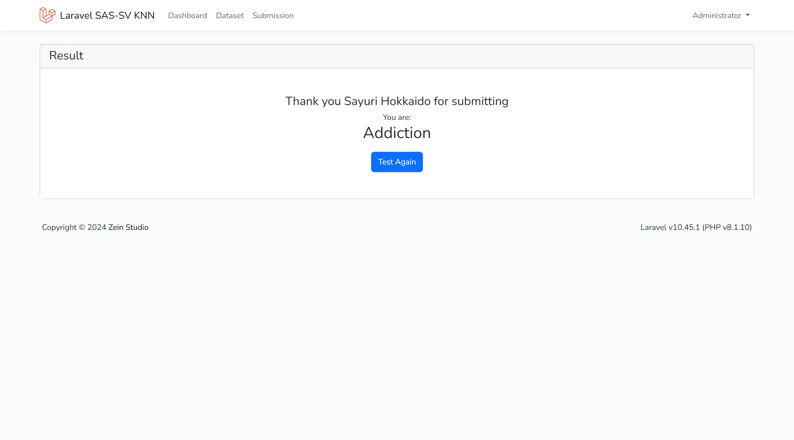

# Laravel SAS-SV KNN

<div style="text-align: center;" align="center">
   Simple Implementation for Classification of Gadget Addiction to Students Using SAS-SV with K-Nearest Neighbor Algorithm Method.
</div>

## Preview

<div style="text-align: center;" align="center">
   <i>Form</i>
   
   <i>Result</i>
   
</div>

## Features

- Auth (for admin)
- Dashboard
- Import Dataset (.csv only)
- Submission (public access)

## Todos

- [x] CRUD
- [x] SAS-SV and KNN Function
- [x] Unit Test
- [ ] Import Dataset
- [x] UI Form Submission and result
- [x] UI Auth
- [x] UI Dashboard

## Project Requirements

- [REQUIREMENTS](./REQUIREMENTS.md)

## References

- Kwon M, Kim DJ, Cho H, Yang S (2013) The Smartphone Addiction Scale: Development and Validation of a Short Version for Adolescents. PLOS ONE 8(12): e83558. https://doi.org/10.1371/journal.pone.0083558
- Kwon, Min; Kim, Dai-Jin; Cho, Hyun; Yang, Soo (2015). Appendix S1 - The Smartphone Addiction Scale: Development and Validation of a Short Version for Adolescents. PLOS ONE. Dataset. https://doi.org/10.1371/journal.pone.0083558.s001
- Majid, B. a. M., Mubarak, A., & Lutfi, S. (2022). Classification of Device Addiction to Students Using SAS-SV with K-Nearest Neighbor Algorithm Method. Journal of Computer Engineering Electronics and Information Technology, 1(1), 39–50. https://doi.org/10.17509/coelite.v1i1.51616

## Licanse

```
Copyright 2024 zeindevs

Licensed under the Apache License, Version 2.0 (the "License");
you may not use this file except in compliance with the License.
You may obtain a copy of the License at

   http://www.apache.org/licenses/LICENSE-2.0

Unless required by applicable law or agreed to in writing, software
distributed under the License is distributed on an "AS IS" BASIS,
WITHOUT WARRANTIES OR CONDITIONS OF ANY KIND, either express or implied.
See the License for the specific language governing permissions and
limitations under the License.
```
